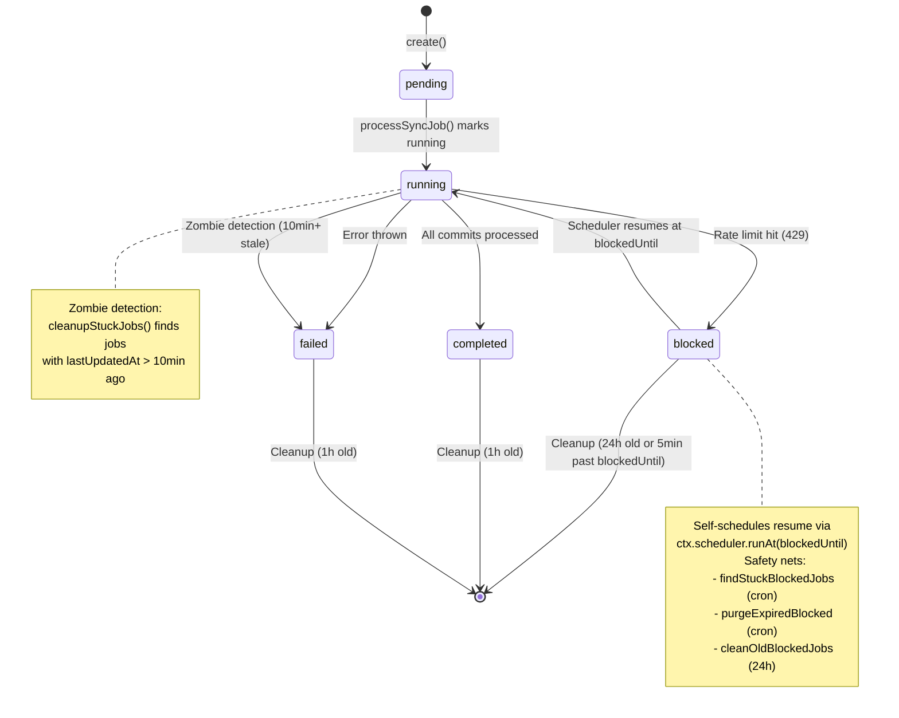
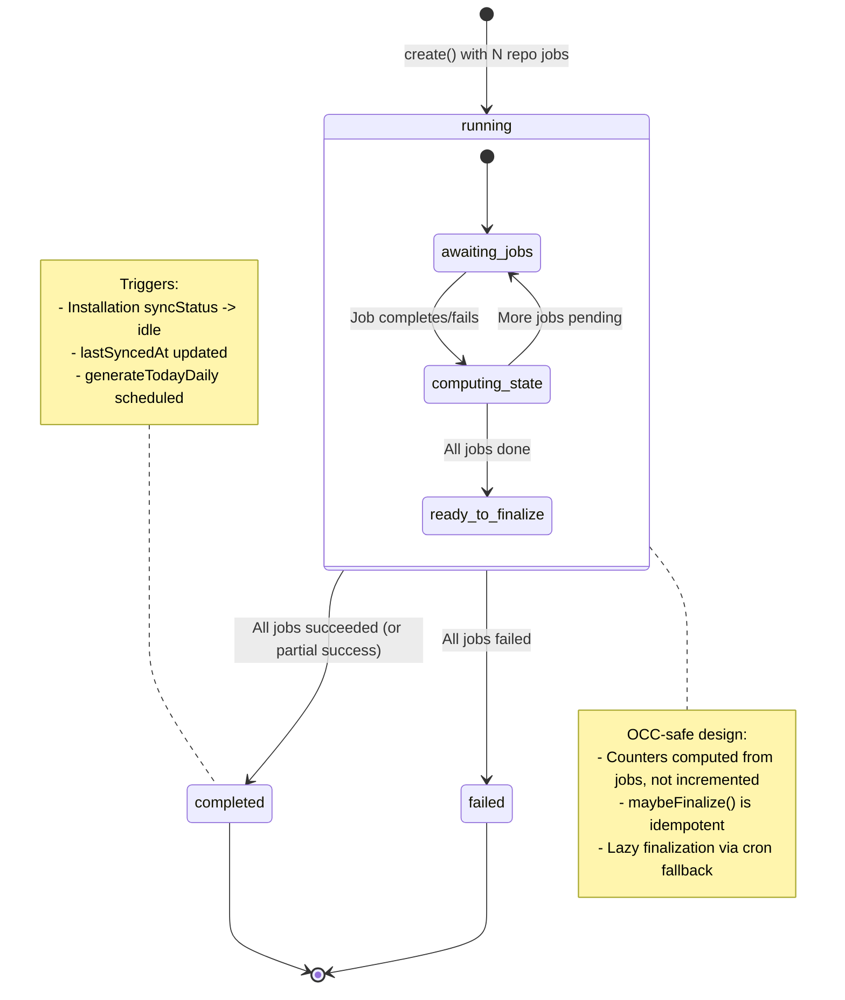
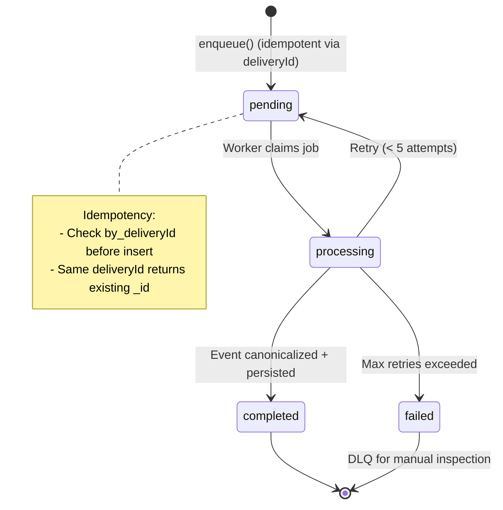
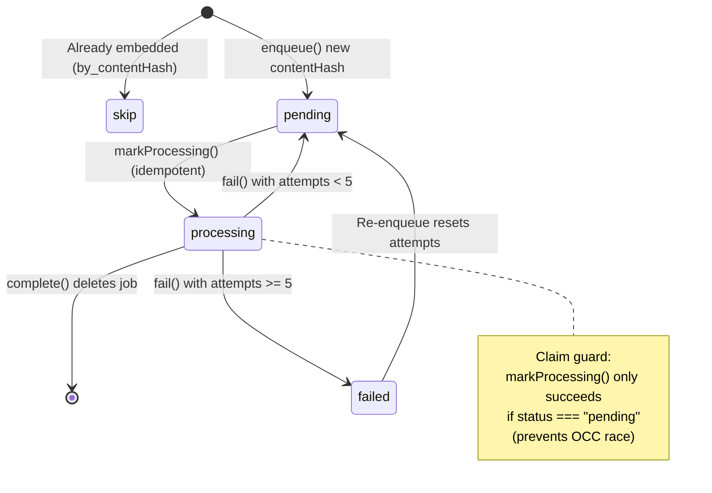
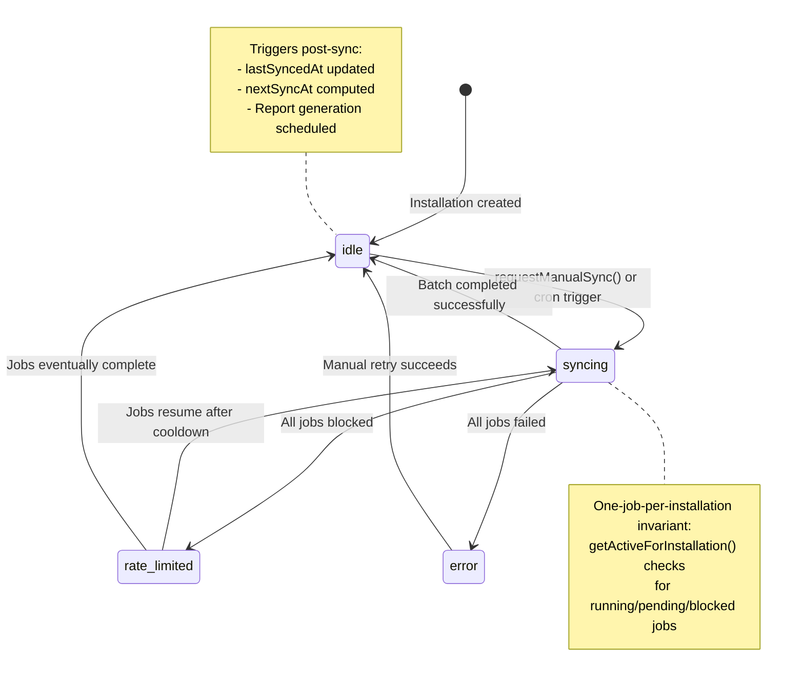
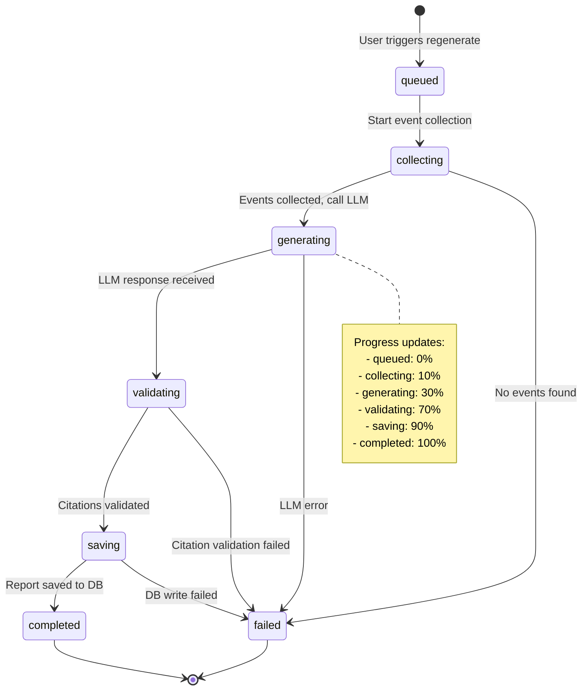
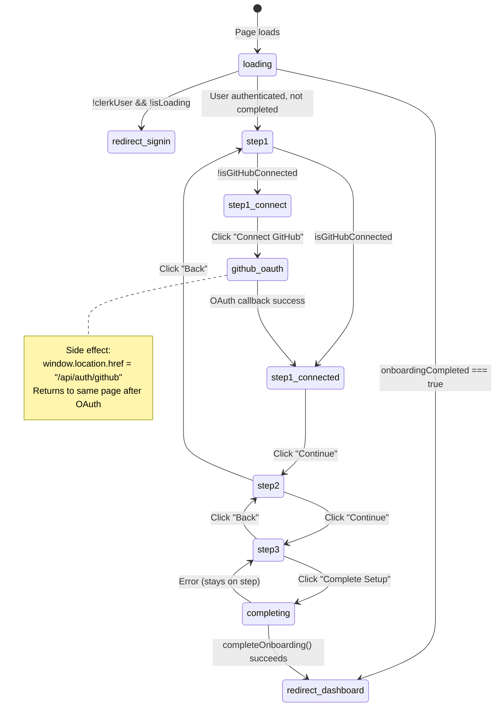
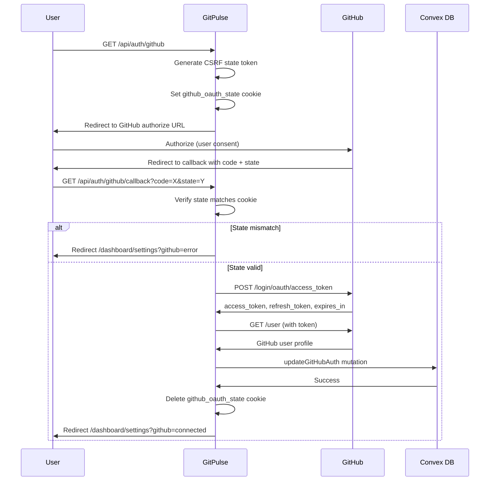
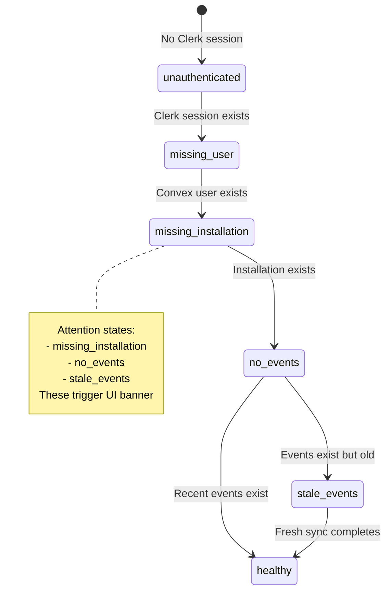

# State Machine Documentation

This document contains Mermaid state diagrams for complex stateful flows in GitPulse.

## 1. Ingestion Job Lifecycle

Jobs track GitHub data sync progress per repository.

**States**: 6 (pending, running, blocked, completed, failed + zombie detection)
**Bug potential**: High - rate limits, zombie jobs, blocked state recovery

**Key files**:
- `/Users/phaedrus/Development/gitpulse/convex/ingestionJobs.ts`
- `/Users/phaedrus/Development/gitpulse/convex/actions/sync/processSyncJob.ts`

---

## 2. Sync Batch Lifecycle

Batches coordinate multiple ingestion jobs (one per repo) for a single sync request.

**States**: 3 (running, completed, failed)
**Bug potential**: Medium - OCC races on counter updates, lazy finalization

**Key files**:
- `/Users/phaedrus/Development/gitpulse/convex/syncBatches.ts`

---

## 3. Webhook Event Processing

Webhook events are enqueued for async processing to ensure <200ms GitHub ACK.

**States**: 4 (pending, processing, completed, failed)
**Bug potential**: Medium - retries, duplicate delivery handling

**Key files**:
- `/Users/phaedrus/Development/gitpulse/convex/webhookEvents.ts`
- `/Users/phaedrus/Development/gitpulse/convex/actions/github/processWebhook.ts`

---

## 4. Embedding Queue Lifecycle

Embedding jobs are content-addressed (by contentHash) for deduplication.

**States**: 3 (pending, processing, failed)
**Bug potential**: Medium - OCC races on claim, retry logic

**Key files**:
- `/Users/phaedrus/Development/gitpulse/convex/embeddingQueue.ts`
- `/Users/phaedrus/Development/gitpulse/convex/actions/embeddings/ensureBatch.ts`

---

## 5. Installation Sync Status

Tracks GitHub App installation sync state for UI display and throttling.

**States**: 4 (idle, syncing, rate_limited, error)
**Bug potential**: Medium - race between manual and cron syncs

**Key files**:
- `/Users/phaedrus/Development/gitpulse/convex/schema.ts` (installations table)
- `/Users/phaedrus/Development/gitpulse/lib/integrationStatus.ts`

---

## 6. Report Regeneration Job

User-triggered report regeneration with progress tracking.

**States**: 7 (queued, collecting, generating, validating, saving, completed, failed)
**Bug potential**: High - long-running action, many failure points

**Key files**:
- `/Users/phaedrus/Development/gitpulse/convex/schema.ts` (reportRegenerations table)

---

## 7. Onboarding Flow (Frontend)

Linear 3-step wizard with conditional progression.

**States**: 3 steps + loading + redirect states
**Bug potential**: Low - linear flow, but has OAuth side-effect

**Key files**:
- `/Users/phaedrus/Development/gitpulse/app/onboarding/page.tsx`

---

## 8. GitHub OAuth Flow

Server-side OAuth with CSRF protection.

**States**: Spans multiple requests (init -> GitHub -> callback)
**Bug potential**: Medium - CSRF, token storage, preview deployment routing

**Key files**:
- `/Users/phaedrus/Development/gitpulse/app/api/auth/github/route.ts`
- `/Users/phaedrus/Development/gitpulse/app/api/auth/github/callback/route.ts`

---

## 9. Integration Status State Machine

Derived status for UI banner display.

**States**: 6 (unauthenticated, missing_user, missing_installation, no_events, stale_events, healthy)
**Bug potential**: Low - read-only derivation

**Key files**:
- `/Users/phaedrus/Development/gitpulse/lib/integrationStatus.ts`

---

## Complex Flows Still Undocumented

The following flows may benefit from diagrams if complexity increases:

1. **Scheduled Report Generation** (`convex/crons.ts`)
   - Currently straightforward: cron -> check midnightUtcHour -> filter Sunday -> generate
   - Low bug potential due to deep module design

2. **Content Hash Deduplication** (`convex/lib/contentHash.ts`)
   - Pure function, no state machine
   - Deterministic: same input -> same hash

3. **Report Cache Key Generation** (`convex/lib/reportOrchestrator.ts`)
   - Pure function combining (kind, userId, dates, contentHashAgg, promptVersion)
   - No state transitions

---

## Maintenance Notes

- Update diagrams when adding new states or transitions
- Test state transitions manually after major refactors
- Watch for zombie states (jobs stuck indefinitely)
- Monitor cron safety nets via Convex logs
