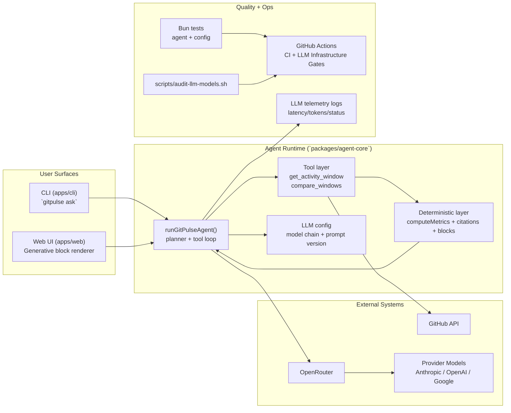
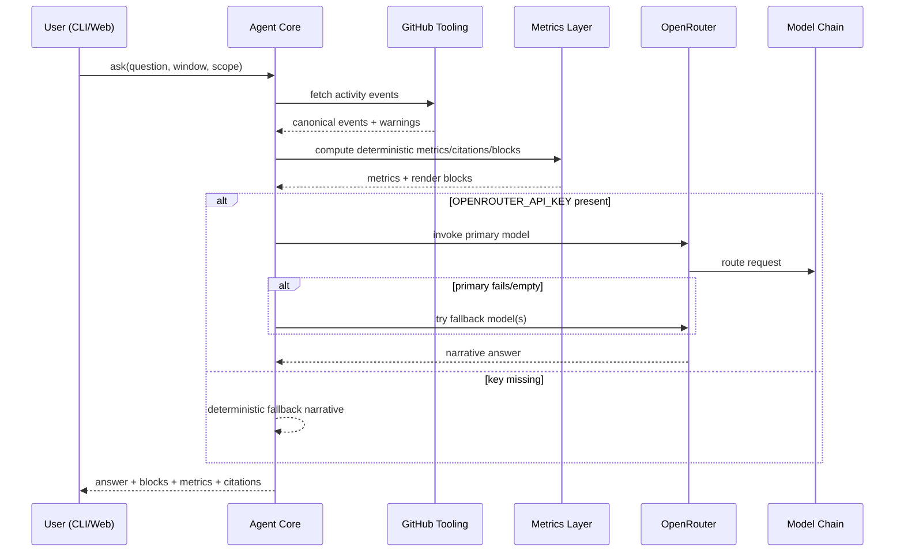

# GitPulse Agentic System Architecture

## Component Diagram

```mermaid
flowchart LR
  subgraph Surfaces["User Surfaces"]
    CLI["CLI (apps/cli)\n`gitpulse ask`"]
    WEB["Web UI (apps/web)\nGenerative block renderer"]
  end

  subgraph Core["Agent Runtime (`packages/agent-core`)"]
    ORCH["runGitPulseAgent()\nplanner + tool loop"]
    TOOLS["Tool layer\nget_activity_window\ncompare_windows"]
    METRICS["Deterministic layer\ncomputeMetrics + citations + blocks"]
    LLMCFG["LLM config\nmodel chain + prompt version"]
  end

  subgraph External["External Systems"]
    GH["GitHub API"]
    OR["OpenRouter"]
    MODELS["Provider Models\nAnthropic / OpenAI / Google"]
  end

  subgraph Quality["Quality + Ops"]
    TESTS["Bun tests\nagent + config"]
    AUDIT["`scripts/audit-llm-models.sh`"]
    CI["GitHub Actions\nCI + LLM Infrastructure Gates"]
    OBS["LLM telemetry logs\nlatency/tokens/status"]
  end

  CLI --> ORCH
  WEB --> ORCH

  ORCH --> TOOLS
  TOOLS --> GH
  TOOLS --> METRICS
  METRICS --> ORCH

  ORCH --> LLMCFG
  ORCH --> OR
  OR --> MODELS
  ORCH --> OBS

  TESTS --> CI
  AUDIT --> CI
```

## Request Lifecycle

```mermaid
sequenceDiagram
  participant U as User (CLI/Web)
  participant A as Agent Core
  participant G as GitHub Tooling
  participant M as Metrics Layer
  participant R as OpenRouter
  participant L as Model Chain

  U->>A: ask(question, window, scope)
  A->>G: fetch activity events
  G-->>A: canonical events + warnings
  A->>M: compute deterministic metrics/citations/blocks
  M-->>A: metrics + render blocks
  alt OPENROUTER_API_KEY present
    A->>R: invoke primary model
    R->>L: route request
    alt primary fails/empty
      A->>R: try fallback model(s)
    end
    R-->>A: narrative answer
  else key missing
    A-->>A: deterministic fallback narrative
  end
  A-->>U: answer + blocks + metrics + citations
```
